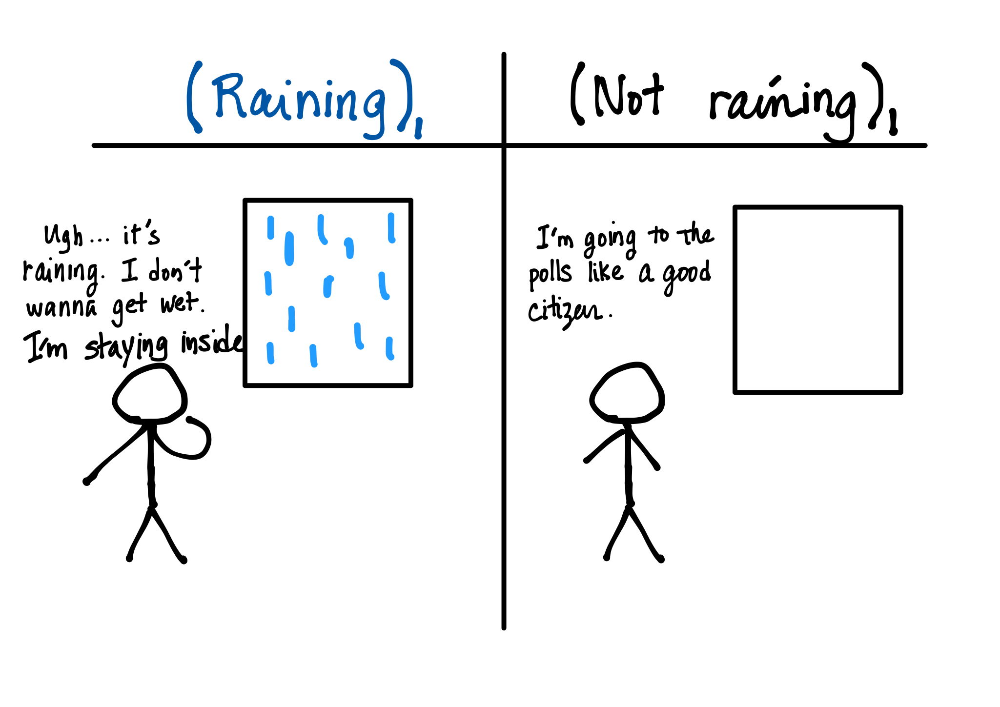
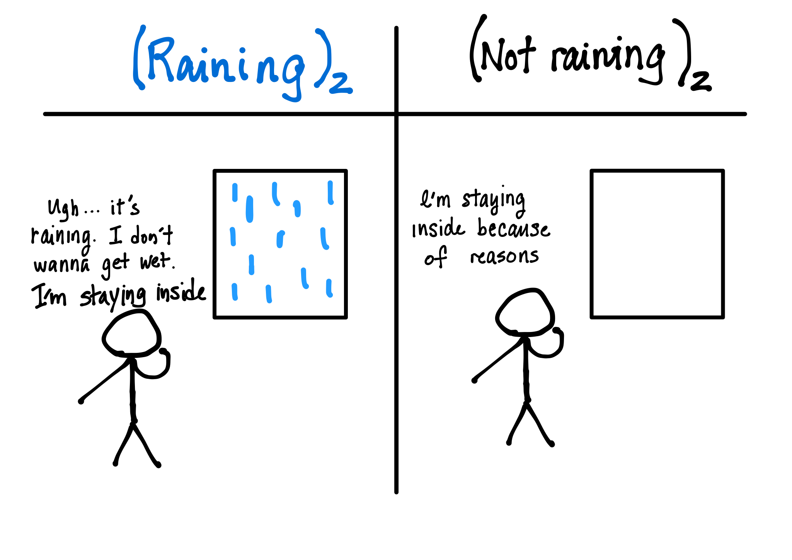

```{r setup, include=FALSE}
knitr::opts_chunk$set(echo = FALSE)
```

## Research question

Does rainfall deter voters from voting on Election Day? If so, what are the characteristics of these voters? 

## Past research results

### *@gomezetal2007*

Rain on election day does deter voters. 

### *@fraga_hersh2010*

Rain on election day deters voters in non-competitive districts.

### *@cooperman2017*

No evidence of negative effect of rainfall on voter turnout when corrected for spatial correlation. 

## What is missing? 

How does rainfall affect a voter's decision on whether to go to the polls on election day? Is it just that people don't want to get wet?


- Think about counteracting forces.
- Think about possible counterfactual scenarios. 


## Counterfactual 1




## Counterfactual 2




## Possible countervailing forces

### Campaign mobilization 

- campaign organizations can be warned about rain on election day 
- campaigns could mobilize volunteers to carpool or keep voters in line 


### Acclimitization to rainy weather in November

- in the United States, elections are set to take place by law on the first Tuesday after November 1st 
- rainfall in November in the United States is relatively predictable
- <-> general elections that happen with parliament's dissolution (e.g. Japan, cf. @horiuchietal2009)


## Where is this paper right now?

- data is all cleaned 
- analysis pending ... 

## References 


